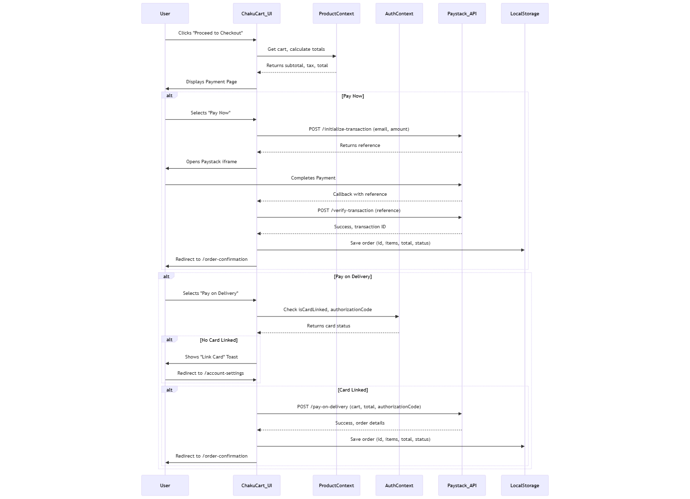

# ChakuCart - Business Profile

**ChakuCart** is an innovative e-commerce platform designed to connect customers with local markets, offering a seamless shopping experience for fresh produce and goods. Built with a focus on convenience, affordability, and supporting local vendors, ChakuCart allows users to browse products from multiple markets, add items to their cart, and choose flexible payment options powered by Paystack. The platform supports both "Pay Now" (immediate card payments) and "Pay on Delivery" (card upon receipt), catering to diverse customer preferences in regions with varying levels of digital payment adoption.

## Key Features
- **Multi-Market Shopping**: Customers can select products from different markets in a single order.
- **Dynamic Shipping Calculation**: Shipping fees are calculated per market based on distance (R10 per km), ensuring fair compensation for riders.
- **Paystack Integration**: Secure payment processing for online transactions and authorization for Pay-on-Delivery orders.
- **User Dashboard**: Track ongoing, pending, completed, and refunded orders with detailed breakdowns.
- **Real-Time Collaboration**: Built with modern React and context APIs for a responsive, state-driven UI.

**Target Audience**: Urban and semi-urban shoppers seeking fresh goods, local market vendors, and delivery riders.

**Business Goal**: To streamline e-commerce for local markets, enhance customer trust through flexible payments, and empower riders with transparent earnings.

ChakuCart is accessible at: [https://chakucart-vert.vercel.app/](https://chakucart-vert.vercel.app/)

---

## How ChakuCart Operates

ChakuCart follows a straightforward yet robust workflow, integrating front-end user interactions with Paystack’s payment infrastructure. Below, we outline the app’s operation, focusing on the checkout and payment process, supported by a UML sequence diagram.

### Operational Workflow
1. **Browsing and Adding to Cart**:
   - Users browse products categorized by markets (e.g., Market A, Market B).
   - Each product includes a `marketId` and `marketDistance` (distance to the user’s address).
   - Items are added to the cart via the `addToCart` function in `ProductContext`.

2. **Cart Review**:
   - The cart groups items by `marketId`, calculates a subtotal, and computes shipping fees per market (`marketDistance * 10`).
   - Tax (15%) is applied to the subtotal, and a total is presented.

3. **Checkout Initiation**:
   - Users proceed to checkout from the cart or dashboard (for ongoing orders).
   - If authenticated and required details (address, payment info) are provided, they’re directed to the payment page.

4. **Payment Processing**:
   - **Pay Now**: Users select "Paystack" and complete an immediate payment.
   - **Pay on Delivery**: Users link a card (for authorization) and confirm the order.
   - Paystack handles transaction initialization and verification.

5. **Order Confirmation**:
   - Post-payment, orders are saved to local storage and redirected to `/order-confirmation`.
   - Delivery status updates are reflected in the dashboard.

### UML Sequence Diagram: Checkout and Payment

### Technical Details
- **Frontend**: React with Hooks (`useState`, `useEffect`, `useContext`), React Router for navigation.
- **State Management**: `ProductContext` for cart and market distances, `AuthContext` for user data.
- **Backend**: Express.js with Axios for HTTP requests to Paystack endpoints.
- **Storage**: LocalStorage persists orders (`freshCartOrders` key).
- **UI Components**: `Header`, `Footer`, `CustomDialog` for modals, styled with Tailwind CSS.

#### Paystack Calls
The backend integrates with **Paystack** for payment processing, making the following API calls:

- **`POST https://api.paystack.co/transaction/initialize`**  
  - **Purpose**: Initializes a transaction for card authorization or full payment.  

- **`GET https://api.paystack.co/transaction/verify/<reference>`**  
  - **Purpose**: Verifies a transaction’s status and retrieves authorization data.  

- **`POST https://api.paystack.co/transaction/charge_authorization`**  
  - **Purpose**: Charges a pre-authorized card for Pay on Delivery upon confirmation.  

- **`GET https://api.paystack.co/customer?email=<email>`**  
  - **Purpose**: Retrieves customer data to update metadata with an authorization code.  

- **`PUT https://api.paystack.co/customer/<customer_code>`**  
  - **Purpose**: Updates a customer’s metadata to save an authorization code.  

- **`POST https://api.paystack.co/refund`**  
  - **Purpose**: Processes a refund for a completed "Pay Now" transaction.  

**Notes**:  
- All calls use the `PAYSTACK_SECRET_KEY` from environment variables for authentication.  
- Split payments are implemented in relevant calls, dividing funds between farmer and transporter subaccounts.

---

## Accessibility

ChakuCart is deployed and fully accessible at:  
**[https://chakucart-vert.vercel.app/](https://chakucart-vert.vercel.app/)**  
Hosted on Vercel, the app is optimized for performance and scalability, ensuring a reliable experience for users and seamless integration with Paystack’s services.

---
